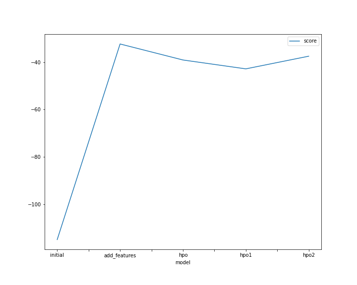
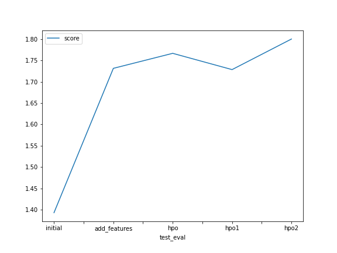

# Report: Predict Bike Sharing Demand with AutoGluon Solution
#### NAME HERE

## Initial Training
### What did you realize when you tried to submit your predictions? What changes were needed to the output of the predictor to submit your results?
When I tried to submit my predictions I realized that there werent some negative values. Knowing the kaggle rejects the results if somehow there is any value less than 0 I needed to check how many negatives I had and then force then to be all zeros.

### What was the top ranked model that performed?
My top ranked model was the one I trained after adding the new features in my dataset, with a score of 1.77553

## Exploratory data analysis and feature creation
### What did the exploratory analysis find and how did you add additional features?
After displaying the histogram of all features I could see how data is distributed. It was possible to see that **season** and **weather** were categorical fields. So in order to fixed it, I change the field type from both fields to categorical. I also checked that the **datetime** field was a timestamp, so in order to get additional features I splitted into year, month, day and hour fields.

### How much better did your model preform after adding additional features and why do you think that is?
After adding additional features my model went from -114.984445 score value to  -35.216661, that happened because we removed the fields that actually were categorical and in the first attempt we considered them as numerical and in the second attempt we splitted the datetime field.

## Hyper parameter tuning
### How much better did your model preform after trying different hyper parameters?
Actually my model performance slightly degraded after trying different HPO. From -35.216661 to -41.139011.

### If you were given more time with this dataset, where do you think you would spend more time?
If I was given more time I try several things, like perform other feature engineering techniques like standardizing features, check feature relevance and dropping the ones that are not so relevant to predict the bike count. I would also evaluate the different models in details. I also check the HPO only on the best model available. A option would also compare my results with the leaderboards for the kaggle competition in order to see the differences and where I can improve my model. 
### Create a table with the models you ran, the hyperparameters modified, and the kaggle score.
|model|timelimit|eval_metric|presets|hpo-method|score|
|--|--|--|--|--|--|
|initial|'600'|'root_mean_squared_error'|'best_quality'|none|1.39308|
|add_features|'600'|'root_mean_squared_error'|'best_quality'|none|1.77553|
|hpo|'600'|'root_mean_squared_error'|'best_quality'|hyperparameters & hyperparameter_tune_kwargs|1.76662|

### Create a line plot showing the top model score for the three (or more) training runs during the project.

### Create a line plot showing the top kaggle score for the three (or more) prediction submissions during the project.

TODO: Replace the image below with your own.

## Summary
In this project we used the AutoGluon to automatically compare and use the best possible model available to predict bike share demand using the bike sharing historical data available. First we gathered the data from Kaggle and then straight to model evaluation, after the this first round we did some feature engineering like changing data types from numerical to categorical and splitting timestamp, after that we got better results. In the third round we performed some HPO and actually got some slightly worse results than the second try. All three results were submmited to Kaggle. After running the models we created some graphs and tables in order to enrich this report.

In general lines, this project was really cool and a great opportunity to use AutoGluon for the very first time and check in a real world problem how it can be used. It was also my first time using SageMaker and the experience was also great.

