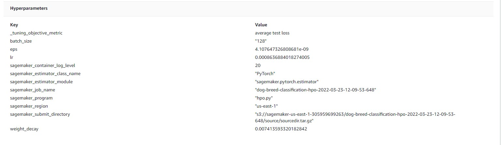
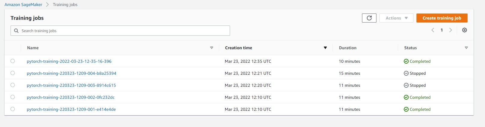
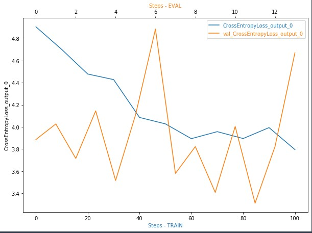
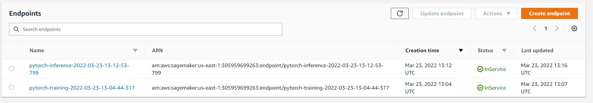

# Image Classification using AWS SageMaker

Udacity AWS Machine Learning Engineer Nanodegree
Jean Carlos da Cruz

In this project we used AWS Sagemaker to train a pretrained model that can perform image classification by using the Sagemaker profiling, debugger, hyperparameter tuning and other good ML engineering practices. We used the provided dog breed classication data set. In order to get the project done we fine-tuned the pretrained model Resnet50 from pytorch library (https://pytorch.org/vision/master/generated/torchvision.models.resnet50.html). After that we performed profiling and debugging with hooks. To check the sucess of the model we deployed it and tested its results using three dog images to see how accurate the model is.

## Project Set Up and Installation
Enter AWS through the gateway in the course and open SageMaker Studio.
Download the starter files.
Download/Make the dataset available.

## Project Files 
- `train_and_deploy.ipynb` - This notebook contains all the required code and the steps performed in this project and their outputs, starting to unzipping the files to test the results on sample images.
- `hpo.py` - This script file contains code that will be used by the hyperparameter tuning jobs to train and test/validate the models with different hyperparameters to find the best hyperparameter
- `train_model.py` - This script file contains the code that will be used by the training job to train and test/validate the model with the best hyperparameters that we got from hyperparameter tuning
- `endpoint_inference.py` - This script contains code that is used by the deployed endpoint to perform some preprocessing (transformations) , serialization- deserialization and predictions/inferences and post-processing using the saved model from the training job.

## Dataset

The provided dataset is the dogbreed classification dataset which can be found in the classroom or in the following link: [here](https://s3-us-west-1.amazonaws.com/udacity-aind/dog-project/dogImages.zip).

### Access

Upload the data to an S3 bucket through the AWS Gateway so that SageMaker has access to the data.

## Hyperparameter Tuning
- The ResNet model represents the deep Residual Learning Framework to ease the training process.
- A pair of fully connected Neural Networks has been added on top of the pretrained model to perform the classification task with 133 output nodes.
- AdamW from torch.optm is used as an optimizer.
- The Following hyperparamets are used:
    - Learning rate-  0.0001 to 0.1
    - eps -  1e-09 to 1e-08
    - Weight decay -  1e-3 to 1e-1
    - Batch size -  [ 64, 128 ]

The `hpo.py` script is used to perform hyperparameter tuning.

 

###Training Jobs

## Debugging and Profiling
The Graphical representation of the Cross Entropy Loss is shown below.

**Is there some anomalous behaviour in your debugging output? If so, what is the error and how will you fix it?**  
*It is not possible to see any smoth outplut line, actually we can see different highs and lows for the batchs.*  

**If not, suppose there was an error. What would that error look like and how would you have fixed it?**  
*We could try setting a proper mix of the batches with shuffling. Also, trying out different neural network architecture could help the model learn better.*

## Model Deployment

The model was deployed into a new machine using a "ml.t2.medium" instance and a script called "endpoint_inference.py" script is used to setup and deploy our working endpoint. In order to quickly testing the accuracy we used three test images (TestImg_Boxer.jpg, TestImg_Japanese_Chin.jpg and TestImg_Norwegian_Buhund.jpg). We tested by inputing those images to the endpoint for inference using the predictor object.
  
